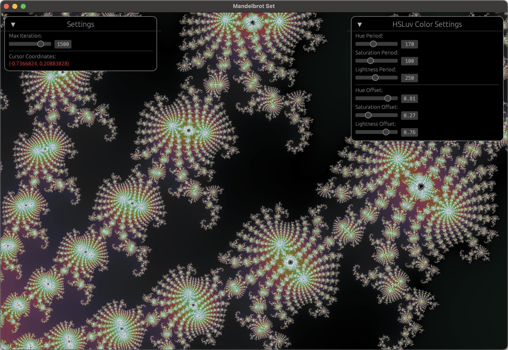

# wgpu-mandelbrot

A Mandelbrot set visualizer built with WGPU + EGUI

## Motivation

One day, I had an unstoppable urge to try GPU programming, and there's no better starter project than this true classic --- **Mandelbrot set visualizer!!**

In terms of tools, I chose to use [WGPU](https://wgpu.rs/) because I really want to be able to have project demos on my website, so web capabilities is a must. As a result, WGPU is really my only option. I also went with [EGUI](https://github.com/emilk/egui) simply because it is super easy to use and integrate with WGPU.

## Screenshots

## Installation

### Native

1. Clone the respository
2. `cargo run`
3. That's it

### Web

1. Clone the respository
2. Install [wasm-pack](https://rustwasm.github.io/wasm-pack/)
3. `wasm-pack build --out-dir web`
   1. For more info, check out wasm-pack's [docs](https://rustwasm.github.io/wasm-pack/book/)
4. Then, you can deploy the files in `web` however you like

## Limitations

1. Has only been tested on MacOS and Chrome Canary
2. Only has 32-bit precision (cannot zoom too deep without seeing artifacts)
3. No supersampling for low-dpi monitors
4. Potential bugs with multimonitor setups